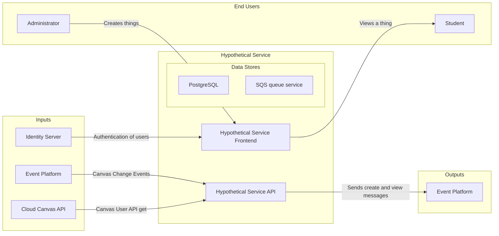

# Example README

This is an example of what we expect in a README.

## What?

A summary of the purpose of this piece of software, for example:
Delivery of Learnosity assessments to students and reporting student results to teachers.

### Diagram

A diagram showing all of the following:

* project inputs
* projects end users
* project outputs
* project data stores

([see mermaid documentation on how to create these diagrams](https://mermaid-js.github.io/mermaid/#/./flowchart?id=flowcharts-basic-syntax))

For example:



## Where?

### Links

A list of links to deployed software
For example:

* dev: [dev.strongmind.com](https://dev.strongmind.com)
* prod: [strongmind.com](https://strongmind.com)

### CI/CD

A link to CI/CD for this repository
For example:

* [https://github.com/StrongMind/culture/actions](https://github.com/StrongMind/culture/actions)

### Administration

A list of links to operational information, for example:

* [Logs](https://us-west-2.console.aws.amazon.com/cloudwatch/home?region=us-west-2#logsV2:logs-insights$3FqueryDetail$%5B%E2%80%A6%5D*2flambda*2fid-mapper-prod$2529$2529)
* [Exception Tracking](https://sentry.io/organizations/strongmind-4j/projects/id-mapper/?project=6262579)
* [Monitoring & Metrics Dashboard](https://us-west-2.console.aws.amazon.com/cloudwatch/home?region=us-west-2#dashboards:name=identifier-mapper-prod)

## Local Install

A set of comprehensive instructions to install from scratch on a developer workstation. We suggest you test these with a member from another team. For example:

### Mac

In this source directory:

1. Install homebrew
1. Install python 3.10 using homebrew `brew install python@3.10`
1. Install virtualenv and virtualenvwrapper `pip install virtualenv virtualenvwrapper`
1. Create virtual environment for project `mkvirtualenv project_name -p /opt/homebrew/opt/python@3.10/bin/python3`
1. Install project requirements `pip install -r requirements.txt`

#### Known Issues and Fixes

If your system python does not include pip, you will need to make sure pip is installed :

```console
python -m ensurepip # if your system python is at least 3.4
```

If your system python isn't at least 3.4, you will need to use your system package manager to install pip.

### Windows

In this source directory:

1. [Install python](https://www.python.org/downloads/release/python-3105/)
1. Open project in pycharm
1. Set interpreter installed python 3.10
1. Open shell
1. Install project requirements `pip install -r requirements.txt`

## Run tests locally

A set of instructions to run tests locally, for example:

```console
pytest
```

## Run service locally

A set of instructions to run service locally, for example:

### Mac (service)

```console
python manage.py runserver
```

### Windows (service)

```console
py manage.py runserver
```

> Code owners can be found in [CODEOWNERS file](./CODEOWNERS)
