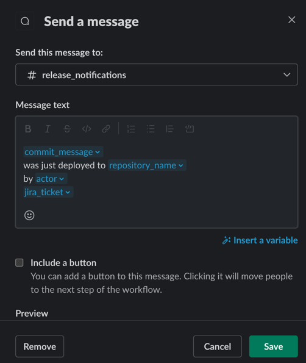

# Slack Release Notification

## Overview
Use these instructions to add a step to your production release workflow that notifies #release-notifications of the release.

## Steps

1. Open the workflow file for your production deployment.
2. Add the following input to the workflow-dispatch:
```yaml
  on: 
    workflow_dispatch:
      inputs:
        jira-ticket:
          type: string
```
3. Add the following job after the job that deploys to production:

> **_NOTE:_** `deploy-prod` in the sample below needs to match the name of the job that deploys to production.

```yaml
  notify:
    name: Notify Slack
    needs: deploy-prod
    uses: strongmind/public-reusable-workflows/.github/workflows/notify-slack.yml@main
    secrets: inherit
    with:
      jira-ticket: ${{ github.event.inputs.jira-ticket }}
```

4. Commit and push your changes to the workflow file.

## Verify
1. Open the Actions tab in your repository.
2. Click the workflow that deploys to production.
3. Click Run workflow.
4. Enter the Jira ticket number for the release.
5. Click Run workflow.
6. Check #release-notifications for the notification.

## Modifying Slack Message
The Slack message is determined by a Slack Workflow called "Release Notifications."
Follow these steps to modify the message:
1. Open Slack.
2. Click on StrongMind.
3. Click Tools.
4. Click Workflow Builder.
5. Click Release Notifications.
6. There are two steps in the workflow.
    - Inputs
    - Message
7. The first step determines the variable inputs. Example:
```json
{
  "repository_url": "Example text",
  "repository_name": "Example text",
  "repository_owner": "Example text",
  "commit_sha": "Example text",
  "commit_url": "Example text",
  "commit_message": "Example text",
  "actor": "Example text",
  "actor_url": "Example text",
  "actor_avatar": "Example text",
  "workflow_url": "Example text",
  "workflow_name": "Example text",
  "jira_ticket": "Example text"
}
```
8. The second step determines the channel and message:

9. Make sure to publish the workflow after making changes.